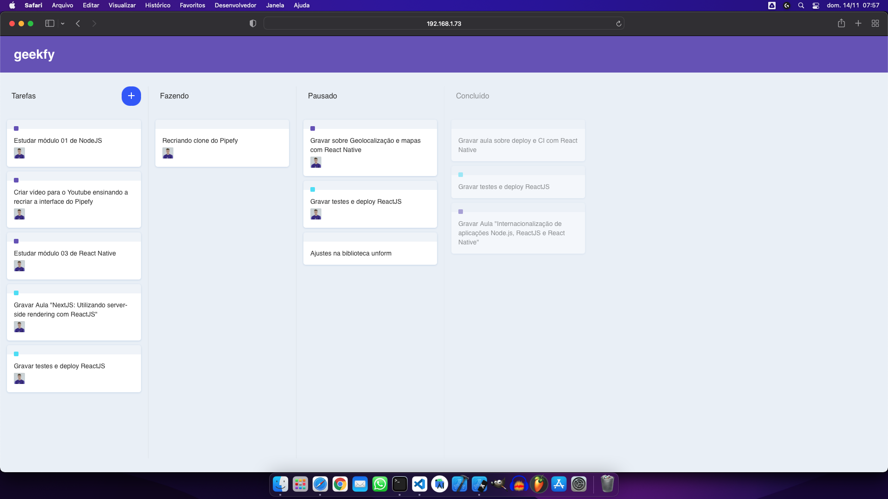

# 📌 GeekFy

**GeekFy** is a simple, intuitive, and visually appealing front-end web application built with React, designed for efficient task management using interactive cards. Easily create, organize, and move tasks to streamline your productivity.

---

## ✨ Features

- 📝 Quickly create task cards
- 📂 Easily organize tasks by moving cards
- 🎨 Modern and responsive design
- 🖥️ Web-based interface for easy accessibility

---

## 🛠️ Technologies

- **React**
- **JavaScript**
- **CSS3**

---

## 🚀 Quick Start

Clone the repository to your local environment:

```bash
git clone https://github.com/gustavofalcao1/GeekFy.git
cd GeekFy
npm install
npm start
```

The application will run at [http://localhost:3000](http://localhost:3000).

---

## 📸 Screenshot



---

## 🤝 Contributing

We welcome contributions to enhance GeekFy:

1. Fork this repository
2. Create your branch (`git checkout -b feature/new-feature`)
3. Commit your changes (`git commit -m 'Add new feature'`)
4. Push changes (`git push origin feature/new-feature`)
5. Open a Pull Request

---

## 📄 License

This project is licensed under the **MIT License**.

---

## 👤 Author

**Gustavo Falcão**  
[GitHub @gustavofalcao1](https://github.com/gustavofalcao1)  
[Project Repository](https://github.com/gustavofalcao1/GeekFy)

---

